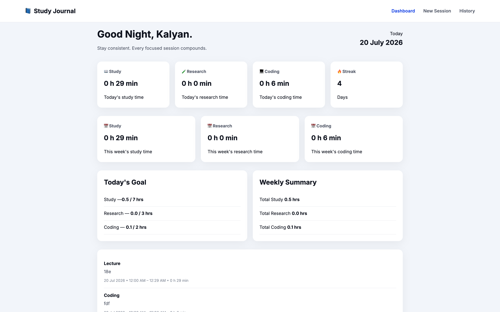
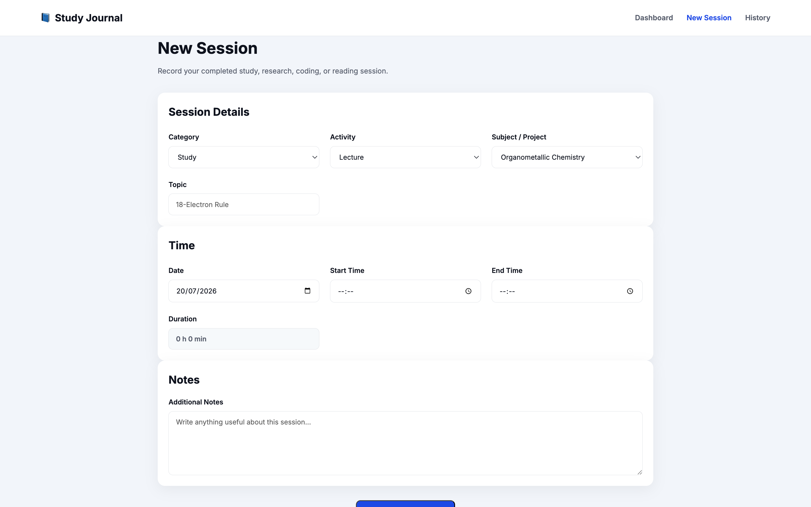
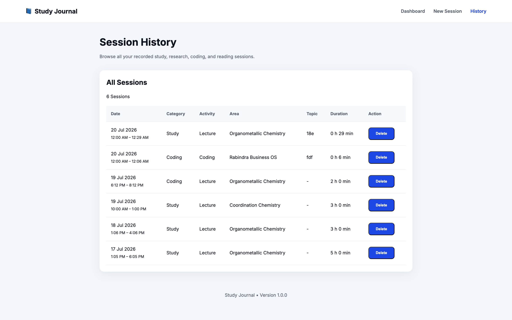

# 📘 Study Journal

A lightweight, offline-first study tracking application built with **HTML**, **CSS**, and **Vanilla JavaScript**.

Study Journal helps you record study sessions, monitor daily and weekly progress, maintain consistency through streaks, and review your study history—all without requiring an internet connection or user account.

---

## Version

**v1.0.0**

---

## Features

### 📊 Dashboard

- Dynamic greeting based on time of day
- Daily Study, Research, and Coding statistics
- Weekly Study, Research, and Coding statistics
- Current study streak
- Daily goal tracking
- Weekly summary
- Recent study sessions
- Quick navigation

---

### 📝 Session Logger

- Log completed study sessions
- Category selection
- Activity selection
- Subject/Area selection
- Topic
- Notes
- Start & End time
- Automatic duration calculation
- Input validation
- Unique session IDs

---

### 📚 Session History

- Complete session history
- Sorted chronologically by **session end time**
- Displays session time range
- Delete sessions
- Empty state handling

---

### 📈 Analytics Engine

Built-in analytics functions provide:

- Today's sessions
- Weekly sessions
- Category-wise study minutes
- Recent sessions
- Current streak

---

### 💾 Offline First

All data is stored locally using **Local Storage**.

No login required.

No internet required.

No external database.

---

## Tech Stack

- HTML5
- CSS3
- Vanilla JavaScript (ES6)
- Local Storage API

---

## Project Structure

```text
Study Journal/

│
├── index.html
├── session.html
├── history.html
│
├── css/
│   └── style.css
│
├── js/
│   ├── config.js
│   ├── storage.js
│   ├── utils.js
│   ├── analytics.js
│   ├── dashboard.js
│   ├── session.js
│   └── history.js
│
├── assets/
│   ├── favicon.ico
│   ├── favicon-16x16.png
│   ├── favicon-32x32.png
│   ├── apple-touch-icon.png
│   └── site.webmanifest
│
└── README.md
```

---

## Architecture

The application follows a layered architecture.

```text
config.js
      │
storage.js
      │
utils.js
      │
analytics.js
      │
────────────────────────────────
│              │              │
dashboard.js   session.js   history.js
```

### Module Responsibilities

| Module | Responsibility |
|---------|----------------|
| config.js | Application configuration |
| storage.js | Local Storage operations |
| utils.js | Shared helper functions |
| analytics.js | Business logic and analytics |
| dashboard.js | Dashboard UI |
| session.js | Session form |
| history.js | Session history |

---

## Current Features

- Daily study tracking
- Weekly progress tracking
- Goal tracking
- Study streak
- Recent sessions
- Session history
- Time range display
- Automatic duration calculation
- Local persistence
- Responsive design
- Favicon support

---

## Screenshots

### Dashboard



### New Session



### Session History



---

## Future Roadmap

### Version 1.1.0

Analytics Dashboard

- Study trends
- Weekly charts
- Monthly charts
- Heatmap
- Longest session
- Average session duration
- Category distribution
- Study area statistics

---

### Version 1.2.0

Search & Filtering

- Search sessions
- Filter by category
- Filter by area
- Filter by date
- Sort options

---

### Version 1.3.0

Data Management

- Export JSON
- Import JSON
- Backup & Restore
- CSV Export

---

### Version 2.0.0

Cloud Sync

- User accounts
- Cloud database
- Multi-device synchronization
- Authentication
- Online backup

---

## Design Principles

- Simple
- Offline-first
- Fast
- Minimal dependencies
- Clean architecture
- Modular codebase
- Responsive design
- Maintainable structure

---

## License

This project is intended for personal productivity and educational purposes.

---

## Author

**Kalyan Singh**

Built as a personal study tracking application to monitor learning consistency and improve long-term productivity.
